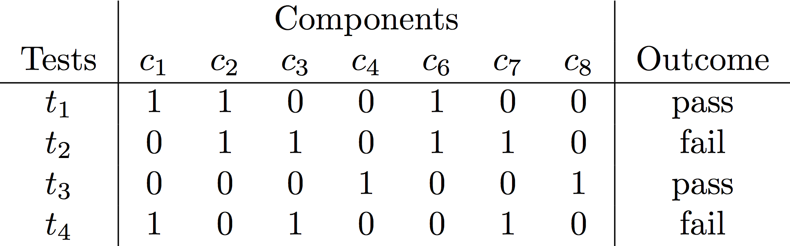

# Fault Cardinality Classifier

Classifies a pair of (faulty, fixing) commits according to the fault cardinality.

This project uses the maven plugin available at
[aperez/aes-maven-plugin](https://github.com/aperez/aes-maven-plugin/tree/single-fault-prevalence)
to perform runtime instrumentation of Java programs.

## Dependencies

* Python 3.4+
* [Virtualenv](https://virtualenv.pypa.io/)
* [Maven](https://maven.apache.org/)

## Usage

To perform a one-time install of the maven plugin, run:
```sh
make install-plugin
```

## Proposed Approach

Given a faulty commit `C` and the fixing commit `C+1` with test suites `T` and `T+1`, respectively:

- `Matrix 1:` Run suite `T+1` in `C`:



- `Matrix 2:` Run suite `T+1` in `C+1` and highlight components in the `delta(C, C+1)`:


- `Matrix 3:` Ambiguity groups are filtered out of `Matrix 2`:


- `Matrix 4:` filter from `Matrix 3` the components that do not belong to `delta(C, C+1)`. These
components cannot be part of a fix introduced by `C+1`.


- `Matrix 5:` filter from `Matrix 4` the tests that do not fail in `Matrix 1` as we are only
interested in tests that expose bugs.


If the **minimal hitting set (MHS)** of the filtered yields *a single solution* of cardinality `1`,
it means that there is one component that is involved every fault-revealing test. In the matrix
above, component `c3` is active in every test, so we consider `C+1` as being a **single fault fix**.
We can use [npcardoso/MHS2](https://github.com/npcardoso/MHS2) as an MHS implementation.

If the matrix is shaped as below:


The set of components `(c3, c5)` has the minimal cardinality so that it explains every test.
Therefore we would have labeled `C+1` as a **multiple fault fix**.
